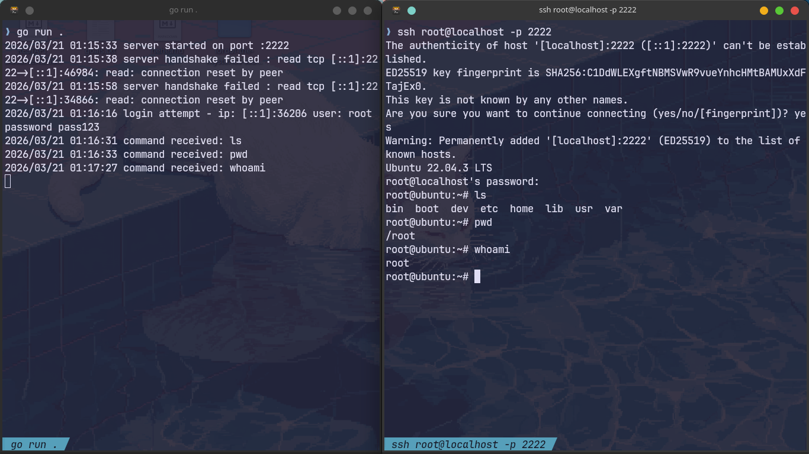

# SSH Honeypot

A lightweight SSH honeypot written in Go that captures attacker credentials and commands. It presents a fake Ubuntu shell to anyone who connects, logs everything they do, and never gives real access to anything.

## What It Does

- Accepts SSH connections on port 2222 (or 22 in production)
- Logs every login attempt with IP, username, and password
- Presents a convincing fake bash shell after authentication
- Logs every command the attacker types
- Saves structured JSON logs for analysis
- Runs in Docker for easy deployment



## Project Structure

```
ssh-honeypot/
├── main.go              # All server logic
├── keys/
│   └── host_key         # Auto-generated ED25519 host key (gitignored)
├── honeypot.log         # Plain text logs (gitignored)
├── attacks.json         # Structured JSON credential logs (gitignored)
├── Dockerfile
└── docker-compose.yml
```

## How It Works

```
Attacker connects on port 22/2222
       ↓
TCP connection accepted
       ↓
SSH handshake (ED25519 host key shown)
       ↓
Password auth → credentials logged to attacks.json
       ↓
Fake shell presented (root@ubuntu:~#)
       ↓
Commands logged, fake responses returned
```

## Getting Started

### Run Locally

```bash
go run .
```

### Run with Docker

```bash
docker build -t honeypot .
docker run -p 2222:2222 -v $(pwd)/keys:/app/keys:z --user=0:0 honeypot
```

### Connect and Test

```bash
ssh root@localhost -p 2222
# Enter any password when prompted
```

## Supported Commands

The fake shell responds to these commands:

| Command | Response |
|---------|----------|
| `whoami` | `root` |
| `id` | `uid=0(root) gid=0(root) groups=0(root)` |
| `uname -a` | `Linux ubuntu 5.15.0-91-generic ...` |
| `ls` | `bin  boot  dev  etc  home  lib  usr  var` |
| `pwd` | `/root` |

Everything else returns `command not found`.

## Log Format

### honeypot.log (plain text)
```
2026/03/21 14:23:11 server started on port :2222
2026/03/21 14:23:45 login attempt - ip: 185.234.x.x user: root password: admin123
2026/03/21 14:23:47 command received: uname -a
```

### attacks.json (structured)
```json
{"time":"2026-03-21T14:23:45Z","IP":"185.234.x.x","user":"root","password":"admin123"}
```

### Analyze credentials
```bash
# Most common passwords tried
cat attacks.json | jq '.password' | sort | uniq -c | sort -rn

# Most common usernames
cat attacks.json | jq '.user' | sort | uniq -c | sort -rn

# Unique IPs
cat attacks.json | jq '.IP' | sort -u
```

## Production Deployment

To expose the honeypot on port 22 and collect real attack data:

1. Move your real SSH to a different port (e.g. 2222) on the server
2. Map port 22 to the honeypot container:

```bash
docker run -d -p 22:2222 -v $(pwd)/keys:/app/keys:z --user=0:0 --restart always honeypot
```

> ⚠️ Only deploy on a dedicated VM. Never on a machine with sensitive data.

## What You'll See

Once deployed on a public IP, bots will find port 22 within hours and start attempting logins. Common patterns include:

- Credential stuffing with default passwords (`admin`, `123456`, `root`)
- Username enumeration (`root`, `admin`, `ubuntu`, `pi`)
- Post-auth commands like `uname -a`, `wget`, `curl` trying to download malware

## Tech Stack

- **Go** — core server
- **golang.org/x/crypto/ssh** — SSH protocol handling
- **Docker** — containerized deployment
- **ED25519** — host key algorithm

## What I Learned

- How the SSH protocol works under the hood (handshake, channels, requests)
- Go concurrency with goroutines for handling simultaneous connections
- Real attacker behavior and common credential patterns
- Structured logging and log analysis

## Legal

This tool is for educational and defensive security research only. Only deploy on infrastructure you own. Never use against systems you don't have permission to monitor.